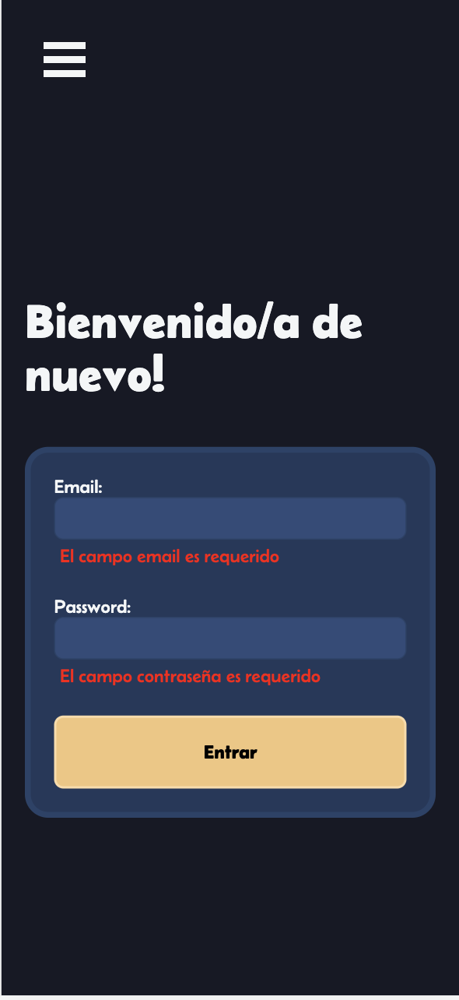

# Fullstack Project - Frontend

---

## Descripción del proyecto

Este proyecto consiste en emular una plataforma de Liga estilo **fantasy** de pádel. En la que el usuario podrá elegir dos jugadores con los que participar durante el próximo torneo.
Los datos han sido extraídos de la página oficial de [World Padel Tour](https://www.worldpadeltour.com)

Dicha extracción se ha realizado mediante un `web scraping`

Cada jugador tiene su valor, dependiendo de la cantidad actual de puntos que posee en el momento de hacer el `web scraping`.

Este valor como máximo podrá ser de `30 monedas`.

Es decir, el jugador o jugadora con más puntos a la hora de obtener los datos, costará 30 monedas y los demás jugadores y jugadoras, obtendrán su valor en proporción a los puntos obtenidos

Este es uno de los dos repositorios que conforman el proyecto. [Aqui](https://github.com/aerozfx/fullstack-project-backend.git) se puede consultar el repositorio de `backend`

En este repositorio se han usado las siguientes librerías: [React](https://es.react.dev/), [Framer](https://www.framer.com/), [SASS](https://sass-lang.com/) o [React Icons](https://react-icons.github.io/react-icons/) entre muchas otras.

**Repositorio con la parte del `cliente` de un proyecto fullstack**

---

## Contenidos

- [Idea](#idea)
  - [Links](#links)
  - [Tecnologías](#tecnologías-usadas)
  - [Capturas de pantalla](#capturas-de-pantalla)
  - [Versión 2.0](#versión-2)
- [Autor](#autor)

### Links

- [Repositorio](https://github.com/aerozfx/fullstack-project-frontend.git)
- [Demo](https://your-live-site-url.com)

## Idea

### Tecnologías usadas

- React
- Framer
- SASS
- HTML5 semántico
- Siguiendo la estrategia de diseño `mobile first`
- useHookForm
- Axios
- SweetAlert
- react-burguer-menu

### Capturas de pantalla

#### Versión Destkop

---

#### Versión móvil

### Versión 2

La siguiente versión mostrará los jugadores adquiridos y los jugadores en activo para el siguiente torneo en la sección `Home`

Algunas de las cosas que me gustaría mejorar:

- Hacer que los filtros sean simultáneos.
- Añadir los jugadores en activo actualmente por el usuario.
- Mostrar los jugadores de la sección `MyPlayers` dentro de `Home` y que desde ahí se puedan marcar como `activos`.
- Añadir el ranking de los distintos usuarios.
- Añadir los puntos del último torneo cosechados por cada jugador

A mejorar como aplicación, independientemente del apartado:

- Añadir ligas a la que el usuario se pueda inscribir, y hacer un ranking de los mejores jugadores
- Actualizar los puntos de los torneos y asignar una cantidad de puntos en función del ranking, ronda alcanzada y demás variables.

## Autor

- Github - [@aerozfx](https://github.com/aerozfx)
